# Kingroon KP3SPro V2 и KLP1 руководство по созданию образа системы и перепрошивке

## Причины
  - Realtek 8723BS работает некорректно. Это приводит к перегрузке системы. Скорость передачи данных может быть очень низкой и нестабильной. 
    Иногда соединение прерывается. Есть альтернатива [Realtek 8723BS driver](https://github.com/youling257/rockchip_wlan). 
    Но если вы захотите скомпилировать его с текущим ядром, у вас ничего не получится, потому что нет заголовков ядра с нужной версией,
    совместимой с загруженным ядром. Альтернативный драйвер загружается быстрее и работает стабильнее.
    Он не обеспечивает максимальную скорость, но обеспечивает стабильность.
  - Альтернативный драйвер дает возможность переключать каналы и т.д..
  - Система выглядит так, как будто она использовалась с разными версиями mcu, имеет множество странных служб и неправильных настроек (например, поврежденные файлы конфигурации logrotate).
  - Kingroon поддержка не помогла. Они просто сказали: "Вы можете сами купить приемник сигнала Wi-Fi, чтобы усилить сигнал. В этом случае эффект должен быть лучше". Конечно, я могу купить другой 
    адаптер и, конечно, другой принтер. Но в него уже встроен wifi-адаптер, и есть способ заставить его работать лучше, так почему бы и нет?
  - Я хочу углубиться в процесс настройки, чтобы поднять свой опыт.

## Требования

  - Кабель USB Type C предназначен для подключения принтера к ПК через последовательный порт.
  - Kingroon KP3SPro V2 (KLP1) с Cheetah V2.0 Motherboard (**Внимание!. Cheetah V2.2 имеет некоторые отличия [difference](#Difference-between-V2-hardware).**)
  - Плата в экструдере должна быть распознана операционной системой принтера как RP2040 (OpenMoko, Inc. rp2040)
  - MKS EMMC Adapter V1.0 или его аналог( у многих шел в комплекте с принтером). **Можно изменить системный образ, не разбирая принтер.** [здесь](#booting-from-USB-flash)
  - microSD устройство для чтения карт памяти, подходящее для работы с EMMC (см. выше)
  - Virtual Machine или ПК с Linux (i.e. Ubuntu/Xubuntu) и установленным docker  [install docker in ubuntu](https://docs.docker.com/engine/install/ubuntu/#install-using-the-repository)
  - Способность решать распространенные проблемы Linux (пропущенные зависимости, программное обеспечение и так далее).
  - Время и терпение :)

## Начнем

### Создание собственного образа Armbian 

**Не хотите собирать? Попробуйте [это](https://github.com/Lebensgefahr/kingroon_kp3s_pro_v2/releases/latest)**. Klipper, Moonraker, Fluidd, printer.cfg и все, что описано в этой статье, включено в нее.

**репозиторий mkspi не обновлен, и процесс сборки завершится ошибкой. Попробуйте выполнить следующие действия https://github.com/Lebensgefahr/kingroon_kp3s_pro_v2/issues/3#issuecomment-2333484221**
Прежде всего, клонируйте [mkspi repository](https://github.com/redrathnure/armbian-mkspi) и создайте свой собственный образ Armbian. Предполагается, что docker уже установлен, и вы можете устранить любые проблемы, вызванные отсутствующими зависимостями.

```bash
mkdir Kingroon && cd Kingroon && git clone https://github.com/redrathnure/armbian-mkspi && 
cd armbian-mkspi && 
./compile.sh
```
<details>
  <summary>Параметры компиляции могут быть примерно такими, как показано на рисунках ниже.</summary>

  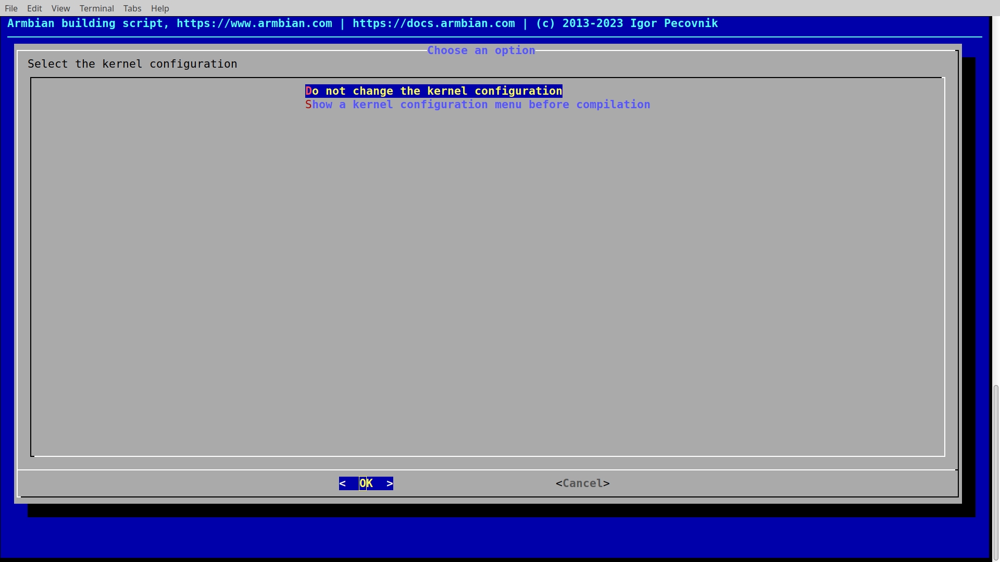
  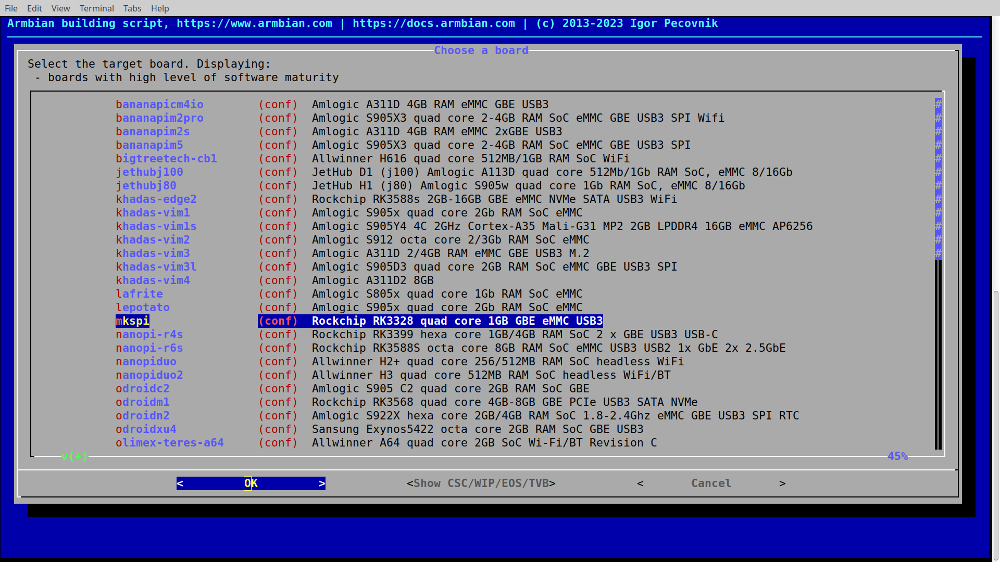
  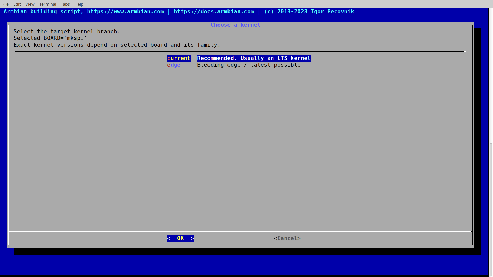
  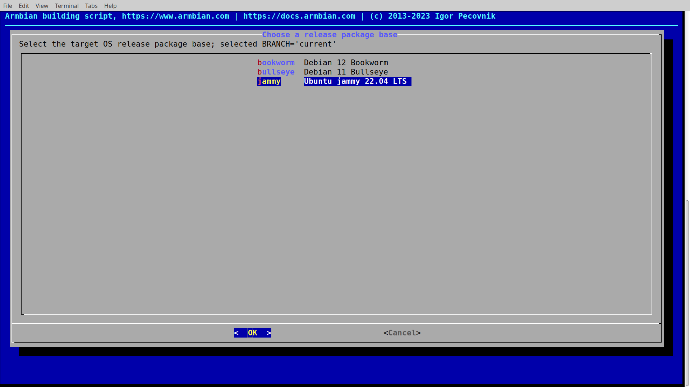
  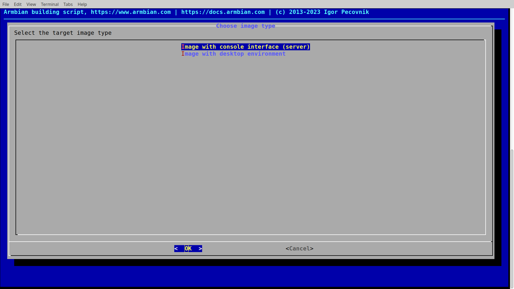
  

</details>

Теперь вам просто нужно набраться терпения (это займет около часа, в зависимости от быстродействия вашего ПК).
В результате сборки вы получите несколько файлов в выходном каталоге, как показано на рисунке.

<details>
  <summary>output directory tree</summary>

  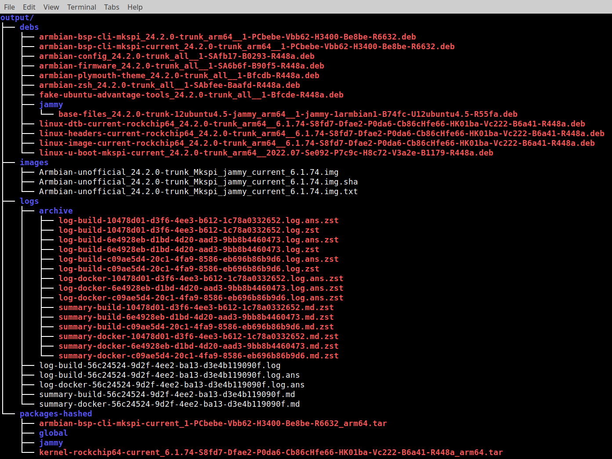

  Необходимый пакет для сборки драйвера Realtek 8723BS находится в каталоге debs:

  **linux-headers-current-rockchip64_24.2.0-trunk_arm64__6.1.74-S8fd7-Dfae2-P0da6-Cb86cHfe66-HK01ba-Vc222-B6a41-R448a.deb**

  Изображение Armbian находится в каталоге images:

  **Armbian-unofficial_24.2.0-trunk_Mkspi_jammy_current_6.1.74.img**
</details>

### Загрузка с USB флэшки
Если вы не хотите разбирать принтер или у вас нет адаптера emmc, вы можете воспользоваться USB-накопителем.
Подготовьте USB-накопитель.:

```bash

sudo dd if=$(ls armbian-mkspi/output/images/*.img) of=/dev/sdb bs=1M status=progress && sync
```
Пользователи Windows могут воспользоваться программой BalenaEtcher для записи образа на флэшку.

И скопируйте образ armbian куда-нибудь в корневой раздел этой флешки, чтобы он был доступен после загрузки.
Затем нам нужно загрузить принтер с этой флешки. Процесс автозагрузки Uboot bootloader может быть прерван нажатием любой клавиши. Но по умолчанию для этого нет задержки загрузки. Поэтому вам нужно нажимать любую клавишу слишком быстро, и иногда это срабатывает. Для этого вам нужно запустить программу последовательной связи, такую как minicom (для windows можно использовать Putty):

```bash

minicom -b 1500000 -D /dev/ttyUSB0
```
Скорость передачи данных должна составлять 1500000 бод, чтобы правильно просматривать booting log.

Затем перезагрузите принтер и начните нажимать на любую клавишу как можно быстрее :-) Если не удалось, перезагрузитесь и попробуйте нажимать быстрее.
Вы можете перезагрузить принтер
через ssh (ssh mks@192.168.1.15 "reboot") и удерживать кнопку ESC в окне терминала (проще, чем нажимать клавиши).
В случае успеха вы увидите приглашение uboot prompt:
```
Hit any key to stop autoboot:  0 
=>  
=>  
```

Измените переменную окружения boot_targets:

```
setenv boot_targets "usb0 mmc1 mmc0 pxe dhcp" 
```
По умолчанию первым загрузочным устройством является mmc1.
И напечатайте команду "boot".
Когда он загрузится, вам следует выполнить указанные действия (создать пароль root, имя пользователя и т.д.). После этого вы можете использовать dd для развертывания образа armbian в /dev/mmcblk1. Перезагрузитесь и повторите предыдущий шаг.
### Создание резервной копии EMMC и подготовка ее к первой загрузке

Снимите нижнюю крышку вашего KP3SProV2 (KLP1) и открутите два винта, которыми крепится модуль EMMC.
Вставьте карту EMMC в адаптер microSD (входит в комплект поставки) и вставьте ее в компьютер.
Некоторые адаптеры не работают с адаптером Makerbase EMMC-microSD. Например, не работает Kingston MobiLite G4.
<details>
  <summary>А это работает</summary>

  
</details>

После вставки EMMC в USB на выходе lsblk появляется новое блочное устройство, подобное /dev/sdb:

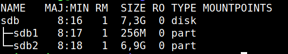

Создайте резервную копию вашей текущей системы:

```bash

mkdir backup && 
sudo dd if=/dev/sdb of=./backup/backup.img bs=1M status=progress && 
sync
```
Этот образ содержит все файлы вашей текущей системы, и он понадобится на следующих шагах, поэтому мы монтируем его сразу после завершения dd.

```bash

sudo losetup --partscan --find --show ./backup/backup.img
```
В Xubuntu он будет автоматически монтироваться в /media/$USER/, и все команды будут указываться с учетом этого пути.

Разверните созданный образ Armbian на /dev/sdb

```bash

sudo dd if=$(ls armbian-mkspi/output/images/*.img) of=/dev/sdb bs=1M status=progress && sync
```
Он снова автоматически подключится после завершения dd.
Теперь нам нужно скопировать пакет linux-headers, старый файл dtb и старые конфигурации в EMMC (с новым dtb wifi не работает).

linux-headers package:
```bash

sudo cp $(ls armbian-mkspi/output/debs/linux-headers*.deb) /media/$USER/armbi_root/root/
```
old dtb file:
```bash

sudo mv /media/$USER/armbi_boot/dtb/rockchip/rk3328-roc-cc.dtb /media/$USER/armbi_boot/dtb/rockchip/rk3328-roc-cc.dtb.bck && 
sudo cp /media/$USER/BOOT/dtb/rockchip/rk3328-roc-cc.dtb /media/$USER/armbi_boot/dtb/rockchip/rk3328-roc-cc.dtb
```
Старые конфигурации (проверьте GUID в поле путь к смонтированному образу старой системы):
```bash

sudo cp -a /media/$USER/4148ed1f-7865-4fd6-84b0-9564c15dbeac/home/mks/printer_data /media/$USER/armbi_root/root/
```
Теперь мы готовы снова подключить EMMC к принтеру, загрузить его и выполнить первый вход в систему.
Первый вход в систему мы должны выполнить от имени пользователя root и с паролем 1234 (по умолчанию для официального образа Armbian).
### Первая загрузка и сборка kernel module

Адаптер Ethernet должен работать, чтобы вы могли подключить его к своему маршрутизатору и попробовать войти с правами root через ssh, если он не отключен.
Вместо этого вы можете использовать кабель USB type C и подключить принтер к пк (разъем usb type-c расположен на передней панели принтера KP3SProV2, для KLP1 необходимо снять крышку подвала и подключиться непосредственно к разъему на плате).
Затем вы можете использовать что-то вроде minicom или putty для подключения к последовательной консоли принтера.
После того, как все подключено, вы можете включить принтер и запустить minicom.

```bash

minicom -b 115200 -D /dev/ttyUSB0
```

Если все идет так, как должно быть, вы можете увидеть что-то подобное в окне терминала:
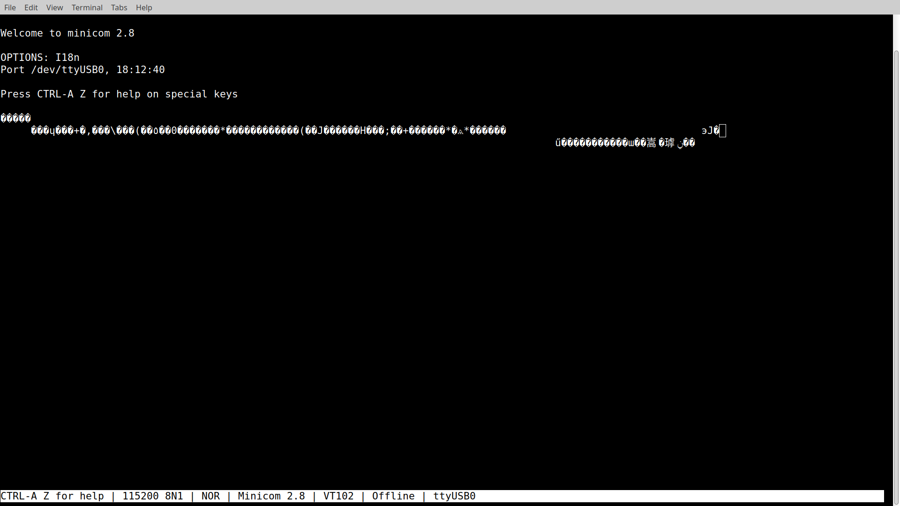

Через несколько минут нажмите enter несколько раз, и вы получите приветствие для входа в систему. В противном случае попробуйте выключить и снова включить принтер. 
После выключения принтера подождите, пока погаснут все светодиоды, особенно светодиоды на материнской плате.
Вы можете увидеть это через нижние отверстия для охлаждения на вашем столе.
Это важно, потому что блок питания продолжает подавать на него энергию во время разрядки конденсаторов.
Войдите в систему с правами root и паролем 1234 и ответьте на все вопросы. 
Это создаст нового пользователя (я использовал mks с паролем makerbase, как и должно быть из коробки).
Вы можете попробовать подключиться по беспроводной сети, но у меня это не работает. Поэтому я пропустил этот этап.
Теперь вы можете установить проводное соединение вручную и подключиться к принтеру через ssh. 
Я подключил принтер к ноутбуку и использую его как маршрутизатор для принтера.

<details>
  <summary>Configure laptop as router and printer as client manually</summary>

  Laptop:

  ```bash

  #protect interface of beeing managed by network manager
  nmcli device set enp43s0 managed off 
  #turn on NAT for printer where 192.168.2.2 is a printer ethernet interface address 
  #and 192.168.1.11 is the address of the laptop given by WiFi router
  sudo iptables -t nat -A POSTROUTING -s 192.168.2.2 -j SNAT --to 192.168.1.11
  #add address to the laptop ethernet interface
  sudo ip addr add 192.168.2.1/24 dev enp43s0 
  #enable ip forwarding in the kernel
  sudo sysctl net.ipv4.ip_forward=1 
  ```  
  Printer:

  ```bash

  nmcli device set eth0 managed off
  #set ip address on ethernet interface
  ip addr add 192.168.2.2/24 dev eth0 
  #set default route through the laptop
  ip route add default via 192.168.2.1
  ```
</details>

To have a key authorization you can run:

```bash

  ssh-copy-id mks@192.168.2.2
```

Заморозьте важные пакеты:

```bash

armbian-config
```
Choose System -> Freeze (Disable Armbian kernel packages)

Создайте файл sudoers, чтобы использовать sudo без пароля:

```bash

sudo bash -c 'cat <<EOF >/etc/sudoers.d/mks
mks    ALL=NOPASSWD: ALL
EOF'
```

Скомпилируйте и установите новый драйвер [Armbian documentation](https://docs.armbian.com/User-Guide_Advanced-Features/#how-to-build-a-wireless-driver):
```bash

apt-get install -y libelf-dev &&
dpkg -i /root/linux-headers*.deb && 
git clone https://github.com/youling257/rockchip_wlan &&
cd rockchip_wlan/rtl8723bs &&
make ARCH=arm64
```

Проверьте, работает ли скомпилированный модуль:
```bash

rmmod r8723bs &&
insmod 8723bs.ko
```

Если все в порядке, то в dmesg будет что-то вроде этого:
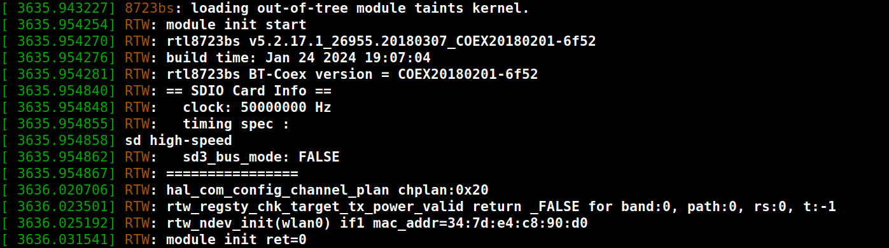

Теперь вы можете установить его в том же месте, где находится старый:

```bash

make -B MODDESTDIR=/lib/modules/$(uname -r)/kernel/drivers/staging/rtl8723bs/ install
```
Внесите старый драйвер в modprobe blacklist:

```bash

sudo bash -c 'cat <<EOF >/etc/modprobe.d/blacklist-r8723bs.conf
blacklist r8723bs
EOF'
```

### Настройки сети

Теперь вы можете перезагрузить принтер, выполнив команду reboot, чтобы проверить, загружается ли новый модуль.
После перезагрузки вы можете попробовать подключиться к беспроводной сети. Создайте файл wpa_supplicant.conf:

```bash
sudo bash -c 'cat <<EOF >/etc/wpa_supplicant/wpa_supplicant-wlan0.conf
country=US
ctrl_interface=DIR=/var/run/wpa_supplicant GROUP=netdev
update_config=1
EOF'

```
Enable wpa_supplicant on wlan0 interface:

```bash

sudo systemctl enable wpa_supplicant@wlan0 &&
sudo systemctl start wpa_supplicant@wlan0
```
Run wpa_cli and enter the following commads:
```
add_network
set_network 0 ssid "YOUR_SSID"
set_network 0 psk "YOUR_KEY"
set_network 0 key_mgmt WPA-PSK
set_network 0 proto WPA2
enable_network 0
save_config
quit
```
Enable DHCP on wlan0 interface
```bash
sudo bash -c 'cat <<EOF >/etc/network/interfaces.d/wlan0
auto wlan0
iface wlan0 inet dhcp
EOF'

```
Restart networking:
```bash

sudo systemctl restart networking
```

### Установка klipper, moonraker, fluidd

Работайте под именем пользователя mks. Клонируйте и используйте kiauh, как описано [здесь](https://github.com/redrathnure/armbian-mkspi):

```bash

git clone https://github.com/th33xitus/kiauh.git &&
./kiauh/kiauh.sh
```

Выберите программное обеспечение для установки.

Klipper: 1->1->1->1

Moonraker: 2 

Fluidd: 4

После завершения установки нам необходимо скомпилировать новую прошивку klipper и
бинарник для платы в голове [читать здесь](https://www.klipper3d.org/RPi_microcontroller.html) и [здесь](https://github.com/makerbase-mks/MKS-THR36-THR42-UTC).
Я попытался использовать новую версию klipper со старой прошивкой, но она не полностью совместима и выдает ошибку.

Все описанное подходит для Raspberry Pi RP2040. Вы можете проверить, существует ли он, с помощью команды lsusb.
Это должно быть что-то вроде этого:
```
Bus 001 Device 002: ID 1d50:614e OpenMoko, Inc. **rp2040**
```

#### Компиляция прошивки для THR:

Выполните:
```bash

cd /home/mks/klipper && make clean && make menuconfig
```

<details>
  <summary>Select compiling options V2.0</summary>

  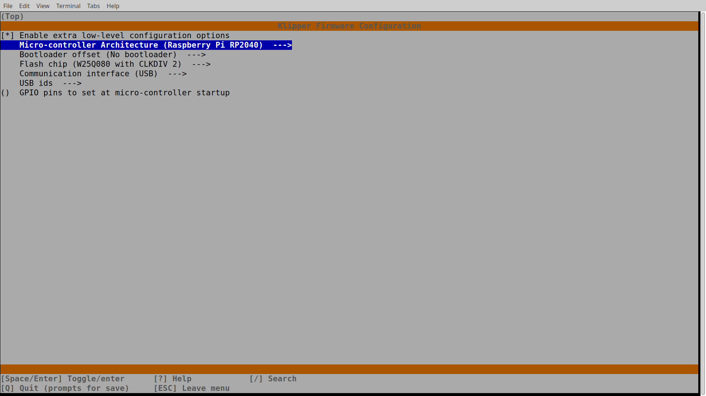
</details>

<details>
  <summary>Select compiling options V2.2</summary>

  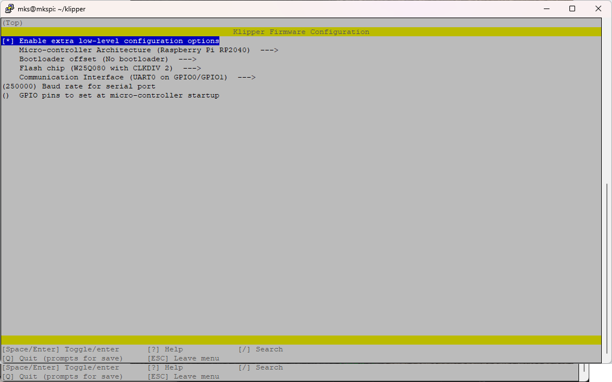
</details>


<details>
  <summary>Соединение THR mcu по USB (for V2.2 version)</summary>
  Вы можете разобрать старую мышь, чтобы получить USB-кабель и разъем JST-XH 2,5 мм (2,54 мм).

  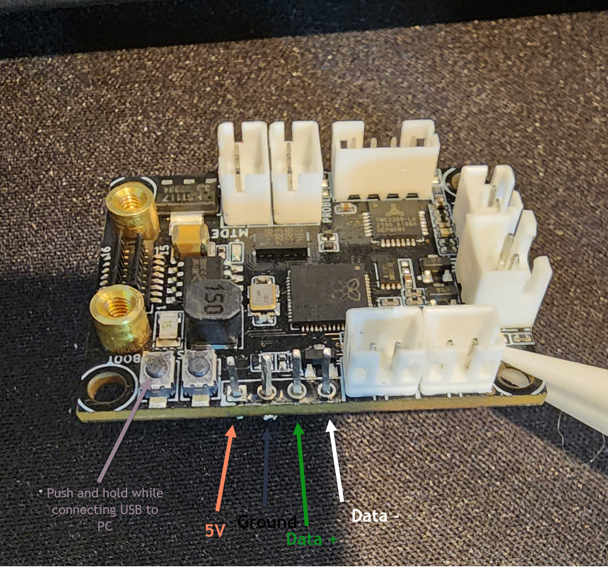
  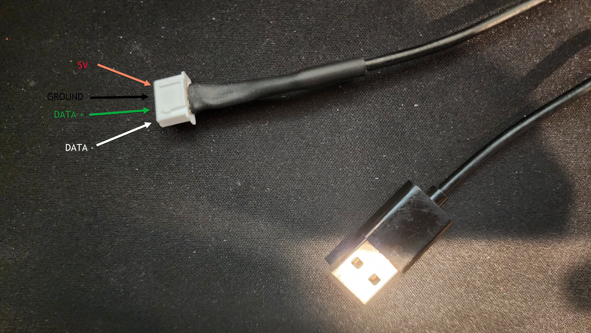
  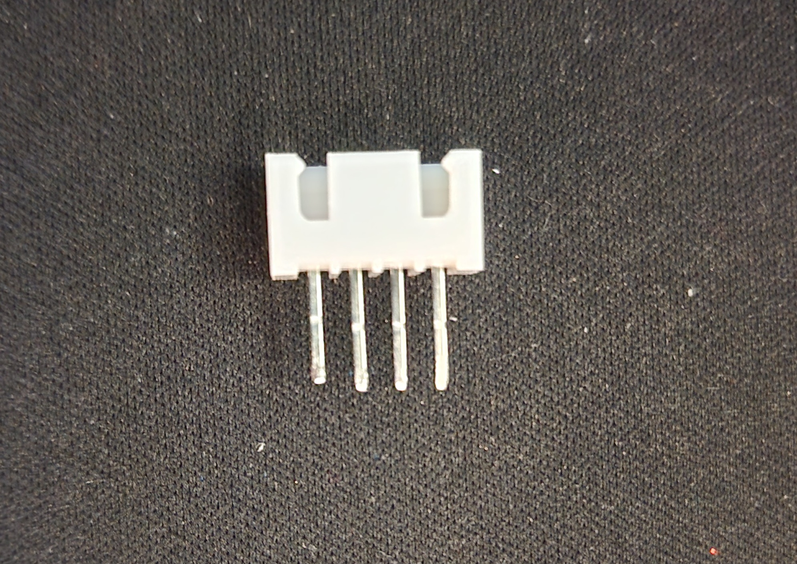

  Прежде чем продолжить, лучше отсоединить оригинальный кабель от модуля THR (**ВНИМАНИЕ!!! Материнская плата может сгореть, если принтер включен
во время отключения модуля THR**).
  После этого подключите свой собственный USB-кабель и включите принтер. Чтобы перепрошить rp2040, вы можете перейти к следующему шагу или сделать это вручную
  <details>
    <summary>Перепрошивка в ручную</summary>
    <ol>
      <li>Удерживая нажатой кнопку "boot" на rp2040, подключите USB-кабель к любому компьютеру, который автоматически подключит USB-накопитель для доступа к файлам (Windows, Ubuntu Desktop, MAC и т.д.).</li>
      <li>Если все сделано правильно и подключено правильно, то будет подключен привод с именем "RP1-RP2".</li>
      <li>Скопируйте файл klipper.uf2 на диск "RP1-RP2"</li>
      <li>rp2040 немедленно перезагрузится и загрузит новую прошивку, как только передача файла будет завершена. Это нормально.</li>
      <li>Подождите 30 секунд, затем отключите rp2040 от сети и снова установите в принтер.</li>
    </ol>
  </details>

</details>


Проверьте, доступен ли ваш микроконтроллер по пути /dev/serial/by-id/. В противном случае попробуйте выключить и снова включить принтер.
Вместо выключения питания принтера вы можете нажать кнопку сброса под крышкой кулера.
Прошивка MCU собранным  firmware:
```
make flash FLASH_DEVICE=/dev/serial/by-id/usb-Klipper_rp2040_05034E955CC76258-if00
```
Если все ок:
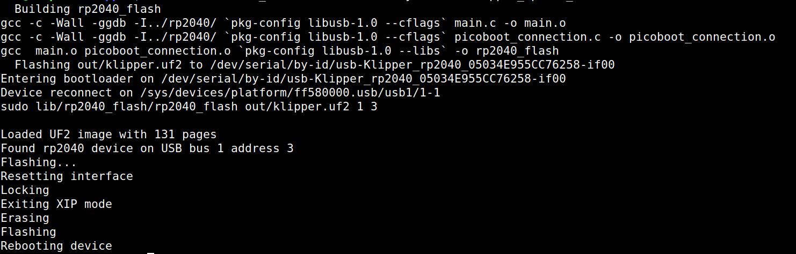

#### Сборка прошивки для MCU на материнке (GD32F303VET6):

Вы можете проверить текущие настройки компиляции в klippy.log для обоих микроконтроллеров.

Для примера:
```
Loaded MCU 'mcu' 105 commands (v0.11.0-122-ge6ef48cd-dirty-20230330_000318-mkspi / gcc: (15:7-2018-q2-6) 7.3.1 20180622 (release) [ARM/embedded-7-branch revision 261907] binutils: (2.31.1-12+11) 2.31.1)
MCU 'mcu' config: ADC_MAX=4095 BUS_PINS_i2c1=PB6,PB7 BUS_PINS_i2c1a=PB8,PB9 BUS_PINS_i2c2=PB10,PB11 BUS_PINS_spi1=PA6,PA7,PA5 BUS_PINS_spi1a=PB4,PB5,PB3 BUS_PINS_spi2=PB14,PB15,PB13 BUS_PINS_spi3=PB4,PB5,PB3 CLOCK_FREQ=72000000 MCU=stm32f103xe PWM_MAX=255 RECEIVE_WINDOW=192 RESERVE_PINS_serial=PA10,PA9 SERIAL_BAUD=250000 STATS_SUMSQ_BASE=256 STEPPER_BOTH_EDGE=1
```

```bash

make menuconfig
```
<details>
  <summary>Select compiling options V2.0</summary>

  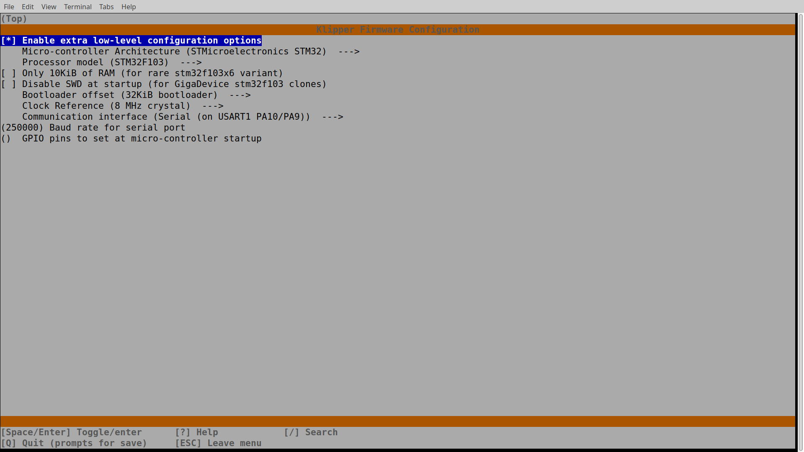
</details>

<details>
  <summary>Select compiling options V2.2</summary>

  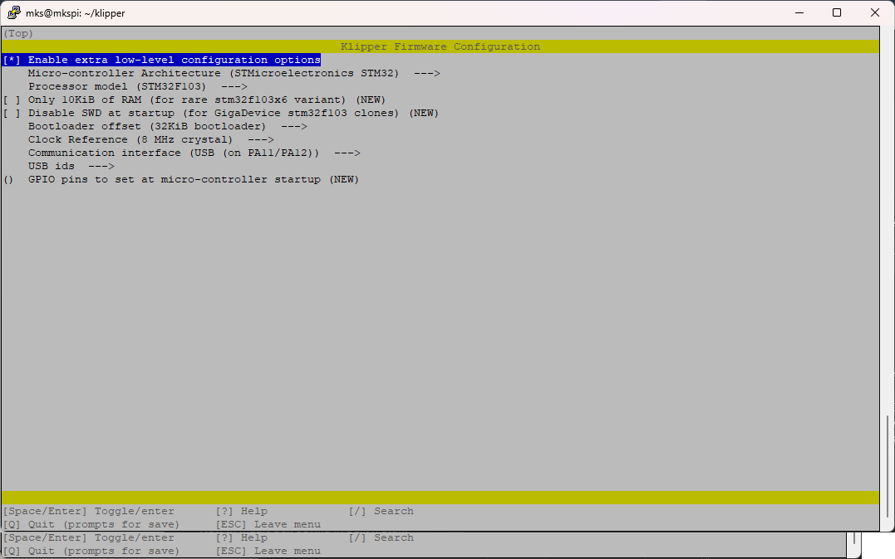
</details>


```bash

make
```

<details>
  <summary>Не хотите использовать внешний считыватель SD-карт или копировать файлы вручную?</summary>
Когда была написана эта статья, это работало, но позже я не смог это повторить. Выдает ошибку, что-то вроде "В слоте нет SD-карты".
В модуле FatFs, включенном в репозиторий klipper, не включена поддержка длинных имен файлов.
Нам нужно включить это.

Edit file:
```
mcedit /home/mks/klipper/lib/fatfs/ffconf.h
```
Set:
```
#define FF_USE_LFN		0
```
to:
```
#define FF_USE_LFN		1
```
Edit file:
```
mcedit /home/mks/klipper/scripts/spi_flash/fatfs_lib.py
```
Set:
```
char     name[13];
```
to:
```
char     name[255];
```
Add board defenition:

```
mcedit /home/mks/klipper/scripts/spi_flash/board_defs.py
```
Add the following lines to BOARD_DEFS dictionary:
```
    'kp3s_pro_v2': {
        'mcu': "stm32f103xe",
        'spi_bus': "swspi",
        'spi_pins': "PC8,PD2,PC12",
        'cs_pin': "PC11",
        'skip_verify': True,
        'firmware_path': "cheetah_v2.bin"
    }

```


В данный момент SD-карта должна быть вставлена в слот для SD-карты принтера.
Теперь выполните следующую команду:

```bash

./scripts/flash-sdcard.sh /dev/ttyS0 kp3s_pro_v2
```
Beeper должен пиликнуть.

Итог:

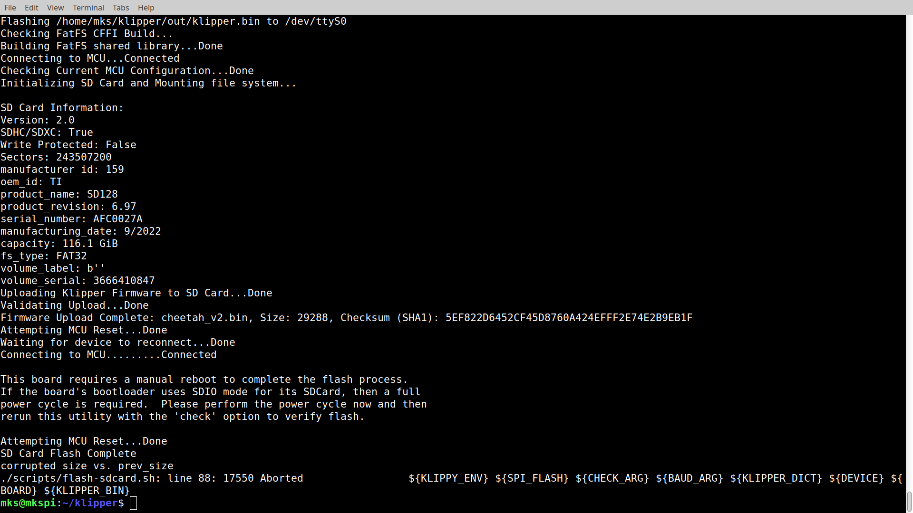

Игнорируйте эту ошибку.
Теперь вам просто нужно выключить и снова включить принтер с помощью команды poweroff.
После установления ssh-соединения запустите следующую команду из каталога klipper:
```bash

 ./scripts/flash-sdcard.sh -c /dev/ttyS0 kp3s_pro_v2
```
Программа сравнит прошитую прошивку с ее образом в основной системе. Если все в порядке, то результат будет следующим:

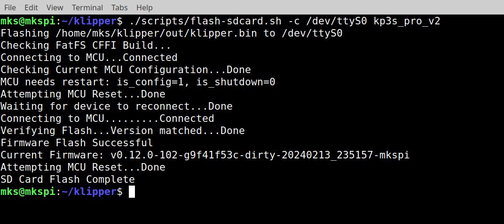

</details>

После сборки скопируйте файл klipper.bin на SD-карту с именем **cheetah_v2.bin** (имя файла важно). Для материнской платы cheetah V2.2
имя файла должно быть **cheetah_v2_2.bin**
Вставьте SD-карту в гнездо для карт памяти принтера, выключите и включите его.

<details>
  <summary>Как получить фактическое имя файла прошивки для mcu на основе MB</summary>
  Если у вас есть программатор st-link, вы можете использовать его для дампа загрузчика и определения имени файла прошивки с помощью утилиты strings.
 St-link можно подключить к контактам, показанным на рисунке.

  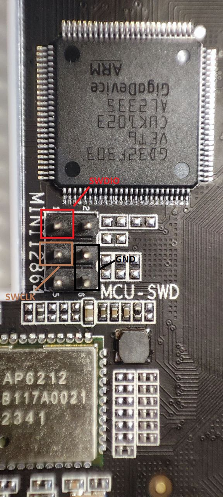

Команда для openocd должна быть такой:

```bash
openocd -f interface/stlink.cfg -f target/stm32f1x.cfg -c init -c "reset halt" -c "flash read_bank 0 firmware.bin 0" -c "reset"

```
Имя файла встроенного программного обеспечения можно определить с помощью strings:
  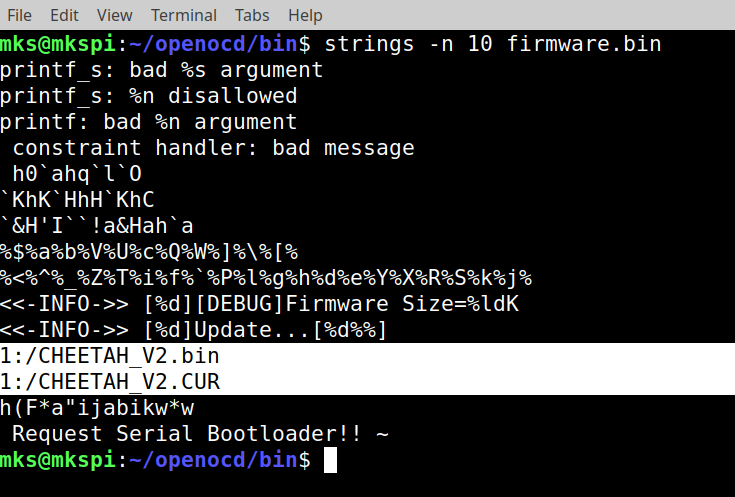

</details>

#### Install binary and systemd unit file:

Проверьте, доступно ли устройство в файле /dev/serial/by-id. В моем случае его не было. Поэтому выключите и снова включите принтер.
Теперь скопируйте старые конфигурационные файлы из образа, смонтированого ранее или из бэкапа:
```bash

scp /media/$USER/4148ed1f-7865-4fd6-84b0-9564c15dbeac/home/mks/printer_data/config/MKS_THR.cfg \
mks@192.168.1.15:/home/mks/printer_data/config/ &&
scp /media/$USER/4148ed1f-7865-4fd6-84b0-9564c15dbeac/home/mks/printer_data/config/moonraker.conf \
mks@192.168.1.15:/home/mks/printer_data/config/ &&
scp /media/$USER/4148ed1f-7865-4fd6-84b0-9564c15dbeac/home/mks/printer_data/config/printer.cfg \
mks@192.168.1.15:/home/mks/printer_data/config/
```
Я предлагаю вам заменить файлы env на systemd из этого репозитория, потому что служебные журналы находятся в каталоге
printer_data, но лучше поместить их на диск RAM, подключенный к /var/log. Поэтому скопируйте их на принтер и замените в каталоге ~/printer_data/systemd.

Теперь нам нужно внести некоторые изменения в системные файлы.

Выполните:
```bash

sudo EDITOR=mcedit systemctl edit klipper.service
```

И поместите следующий контент прямо в нужное для них место (прочитайте содержимое файла).:

```
[Service]
LogsDirectory=klipper
RuntimeDirectory=klipper
```
Сохраните изменения, нажав клавишу F2 и завершив работу.

Сделайте то же самое для moonraker:

```bash
sudo EDITOR=mcedit systemctl edit moonraker.service
```
```
[Service]
LogsDirectory=moonraker
```
Теперь остановите все службы, удалите журналы из каталога printer_data и запустите их снова.

```bash
sudo systemctl stop moonraker.service klipper.service && 
rm -rf ~/printer_data/logs/{klip*,moon*} &&
sudo systemctl start moonraker.service klipper.service
```
Проверьте логи в/var/log на наличие ошибок.
Я не копировал старую конфигурацию fluidd и макросы, но вы можете это сделать.

### Дополнительные изменения

#### Инверсия энкодера

Меня раздражало, что энкодер работает в обратном направлении. Когда он вращается CW, значения уменьшаются, но должны увеличиваться.
Все, что нам нужно сделать, чтобы исправить это, - это подмести контакты в printer.cfg. Вы можете сделать это через интерфейс fluidd на вкладке Configuration.
```
#encoder_pins:^PE13,^PE14
encoder_pins:^PE14,^PE13
```
#### Turning on mesh fade

Добавьте параметры в файл конфигурации в разделе bed_mesh, чтобы постепенно отменить настройку bed_mesh. По умолчанию значение fade_end равно 0, и это означает, что оно отключено.
Эта опция полностью отключает использование bed mesh. В противном случае кривизна таблицы будет сохраняться по всей высоте модели.
Конечно, вы должны использовать значения, которые меньше высоты модели. Читать [здесь](https://www.klipper3d.org/Bed_Mesh.html#mesh-fade).

В этом примере выцветание начинается на высоте 1 мм и заканчивается на высоте 5 мм.
```
[bed_mesh]
fade_start: 1
fade_end: 5
```

#### Setup menu

После обновления прошивки меню kingroon исчезнет. Вы можете вернуть его обратно, сравнив файл menu.cfg из изображения с новым.
Но не редактируйте его. Вы можете поместить изменения в файл printer.cfg. За исключением одной функции. Kingroon добавил определение IP-адреса в виде кода на python.

### Final

Выполните повторную калибровку mesh, и это все. Теперь вы можете удалить linux-headers, чтобы освободить место. 
Но хорошо бы иметь этот пакет под рукой в целевой системе. Прежде чем открывать нижнюю крышку, рекомендуем
создать резервную копию вашей системы, как описано в начале.
Спасибо, что прочитали.

### Difference between V2 hardware

<table>
  <tr>
    <th>V2.0</th>
    <th>V2.2</th>
  </tr>
  <tr>
    <td width="50%" valign="top">
      <ul>
        <li>THR MCU connected via USB</li>
        <li>MCU on the motherboard connected via UART</li>
        <li>Thermal barrier cooler can't be controlled by THR MCU</li>
        <li>THR plate can be flashed without disassembling</li>
        <li>It has Realtek 8723BS Wi-Fi adapter</li>
        <li>Firmware file name written to SD card for flashing mcu should be cheetah_v2.bin</li>
      </ul>
    </td>
    <td width="50%" valign="top">
      <ul>
        <li>THR MCU connected via UART</li>
        <li>MCU on the motherboard connected via USB</li>
        <li>Thermal barrier cooler can be controlled by THR MCU</li>
        <li>THR plate can be flashed after disassembling and soldering pins to USB contacts (you can see it on the picture below marked with 5V GND D+ D-)</li>
        <li>It has a different Wi-Fi adapter</li>
        <li>Firmware file name written to SD card for flashing mcu should be cheetah_v2_2.bin</li>
      </ul>
    </td>
  </tr>
  <tr>
    <td colspan=2 align="center">Motherboard</td>
  <tr>
    <td>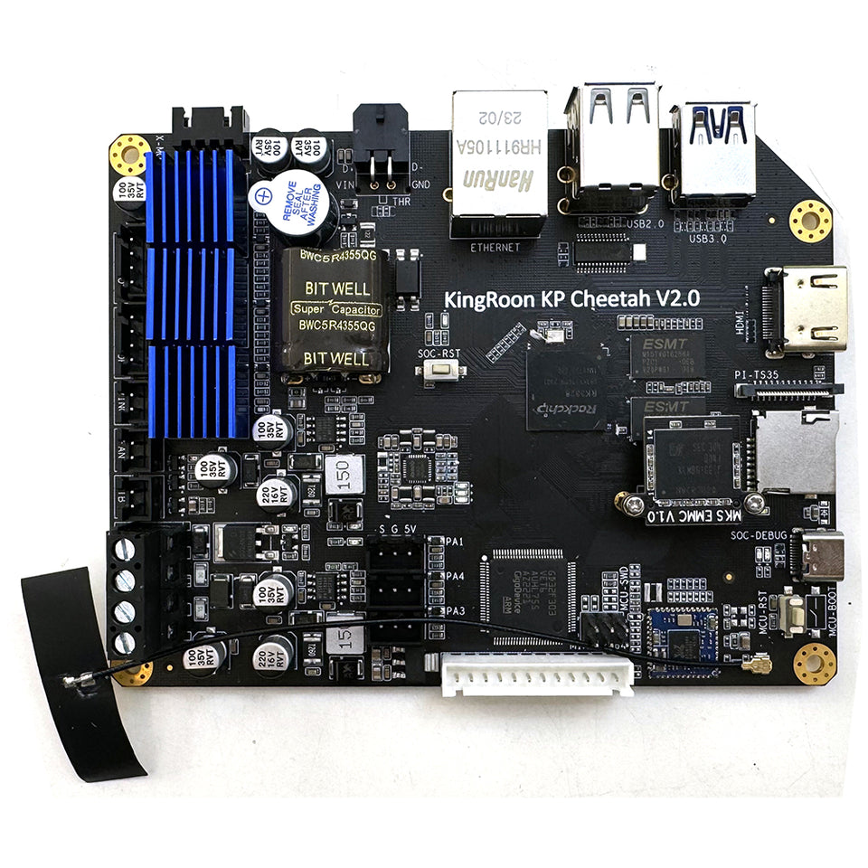</td>
    <td>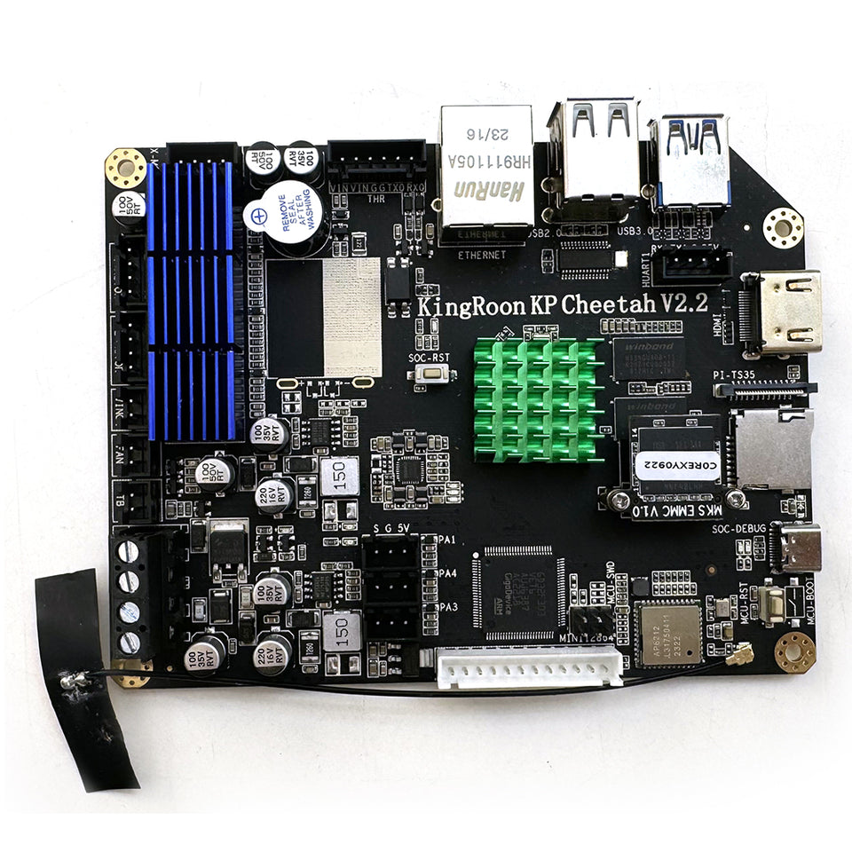</td>
  </tr>
  <tr>
    <td colspan=2 align="center">THR</td>
  <tr>
  <tr>
    <td>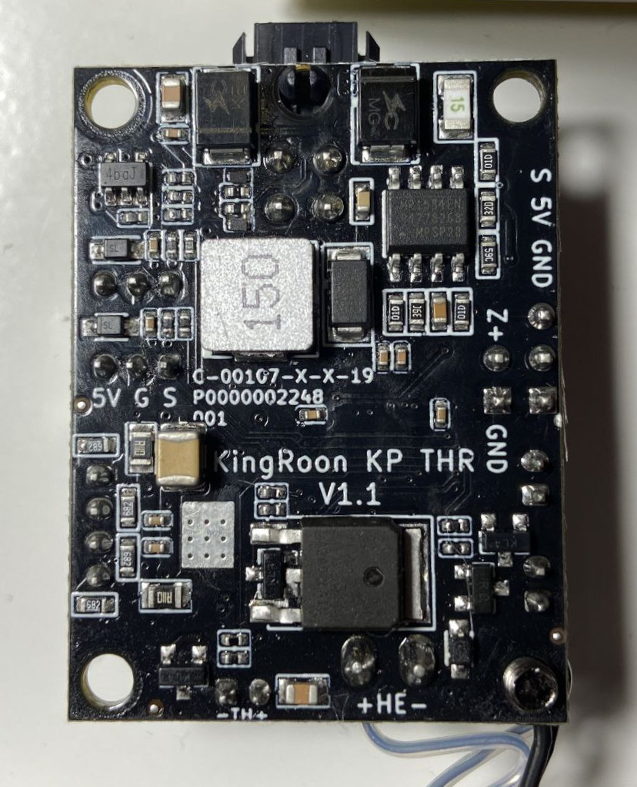</td>
    <td>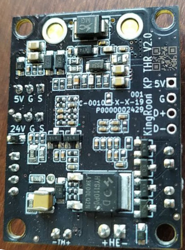</td>
  </tr>
  <tr>
    <td>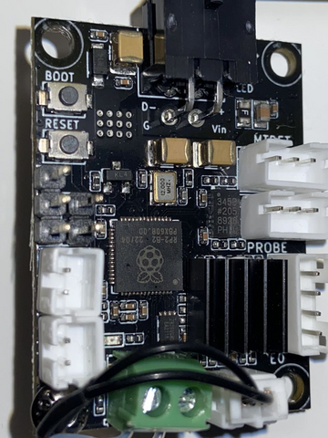</td>
    <td>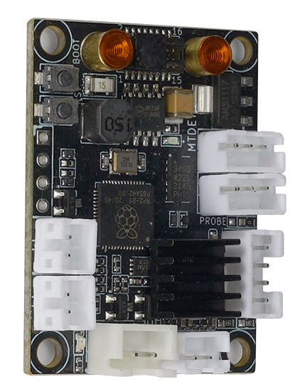</td>
  </tr>
</table>

